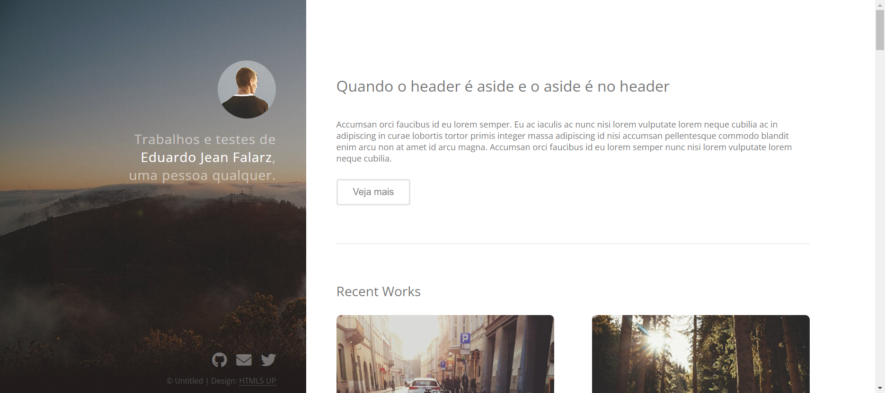

# Projeto STRATA

## Introdução

Este desafio teve como propósito a aplicação dos recursos CSS e HTML aprendidos no curso até então. Além das ferramentas ensinadas, utilizei também conhecimentos prévios em Flexbox e Media Queries.

## Imagens 

### • Desktop

</img>

</img>

</img>

### • Mobile

</img>

</img>

</img>

## Links

• GitHub: <a>https://github.com/FalarzEdu</a>

• GitHub Pages do Projeto: [Link](https://falarzedu.github.io/Projetos-Udemy/HTML,%20CSS%20E%20JS%20BÁSICO-INTERMEDIÁRIO/Projeto%20STRATA/)