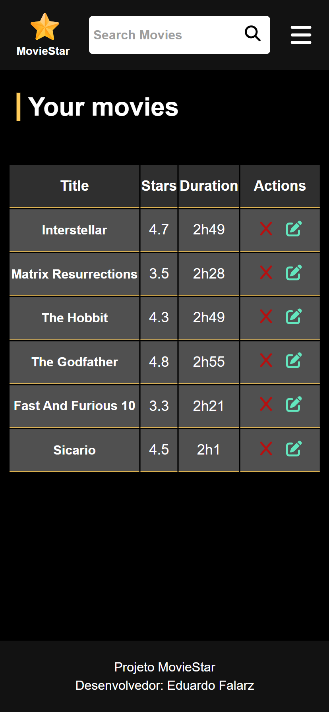

<h1>Projeto Movie Star</h1>

<h2>Saudações!</h2>

<h3>Sumário</h3>

<ol>
	<li> <a href="#intro">Introdução</a> </li>
    <li> <a href="#meto">Metodologias e ferramentas</a> </li>
    <li> <a href="#img">Imagens</a> </li>
    <li> <a href="#teste">Como testar</a> </li>
    <li> <a href="#conclusao">Conclusão</a> </li>
</ol>

<h4 id="intro">Introdução</h4>

O projeto Movie Star é um site desenvolvido como projeto final de um curso de PHP realizado por mim. Ele consiste, basicamente, de um espaço onde os usuários podem adicionar informações básicas de filmes (como a arte, trailer e descrição) e avaliá-los para que outras pessoas estejam por dentro das críticas de obras cinematográficas (recém lançadas ou antigas).

<h4 id="meto">Metodologias e ferramentas</h4>

Para o desenvolvimento da plataforma, utilizei PHP, HTML, CSS e MySQL. Como meu foco foi o estudo de tecnologias empregadas no back-end, decidi fazer um design mais básico para o site.

Para a comunicação com o banco de dados, utilizei o módulo PDO (PHP Data Objects), focando na construção da lógica com o padrão DAO (Data Access Object) para encapsular, utilizando POO, os métodos de tráfego de dados entre a aplicação e o banco.

<h4 id="img">Imagens</h4>

<h4 id="teste">Como testar</h4>

Caso você possua interesse de testar a aplicação e explorar seu código, aqui estão alguns passos:

<ol>
    <li>Baixe o pacote de servidores XAMPP.</li>
    <li>Entre nos arquivos do XAMPP, procure pela pasta "htdocs" e aloque os arquivos do projeto dentro dela.</li>
    <li>Ligue os servidores Apache e MySQL.</li>
    <li>Navegue até "localhost" em qualquer navegador.</li>
    <li>Abra o "phpMyAdmin".</li>
    <li>Selecione a opção "importar" e selecione o arquivo da estrutura do banco de dados. Ele está localizado na basta "database" e possui a extensão ".sql".</li>
    <li>Ainda no navegador, digite no campo de URL "localhost/movie_star/index.php".</li>
</ol>

<h4 href="conclusao">Conclusão</h4>

O desenvolvimento deste site foi uma maneira interessante de consolidar conhecimentos básicos de PHP e bancos de dados relacionais. Durante o processo, pude ter uma visão mais ampla e aprofundada de como ocorrem as atividades desempenhadas "atrás dos panos" em uma aplicação. Além disso, ao usar o módulo PDO e o padrão DAO, tive a oportunidade de trabalhar com o paradigma de orientação à objetos e torná-lo um pouco mais familiar à mim. De maneira geral, foi uma boa forma de iniciar meus estudos na linguagem PHP.
 